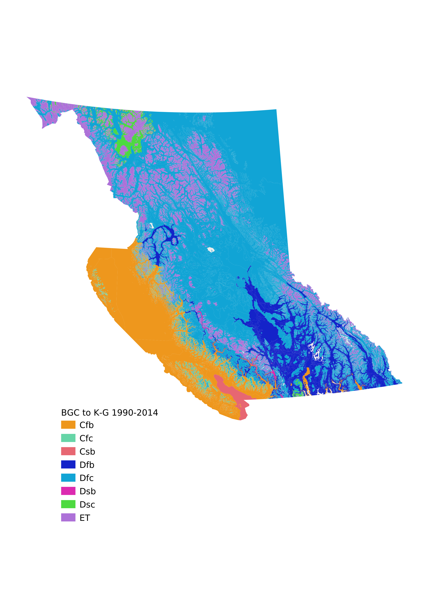

# BEC to Koppen-Geiger

## What's this?
This is a [Jupyter Notebook](https://jupyter.org/) with some Python code to classify climate data (in this case from British Columbia [Biogeoclimatic](https://cfcg.forestry.ubc.ca/resources/cataloguing-in-situ-genetic-resources/about-bec-and-bgc-units/) Ecosystem Classification [subzones](https://www.for.gov.bc.ca/hre/becweb/)) by the [Köppen-Geiger](https://en.wikipedia.org/wiki/K%C3%B6ppen_climate_classification) classification system.

## Ok, how do I use it?
The fastest way to figure out what is going on here is to [read the output](2021-01-18_Gayton_BGC_to_Koppen-Geiger.pdf), which (and this is the cool thing about Jupyter Notebooks) is basically the actual working code embedded in a narrative report, with visualizations of the output baked in.

## Now what?
The second thing to do is to set it up and play with it. You'll need a computer with [Python](https://www.python.org/) on it, and the [Jupyter Notebooks environment](https://jupyter.org/install) with the [Pandas](https://pandas.pydata.org/) data analysis framework. The easiest way to get there is an [Conda](https://en.wikipedia.org/wiki/Conda_(package_manager)) environment. I used [Miniconda](https://docs.conda.io/en/latest/miniconda.html) to build this, so that's probably the best route.

####TODO: add the full setup and install procedure

